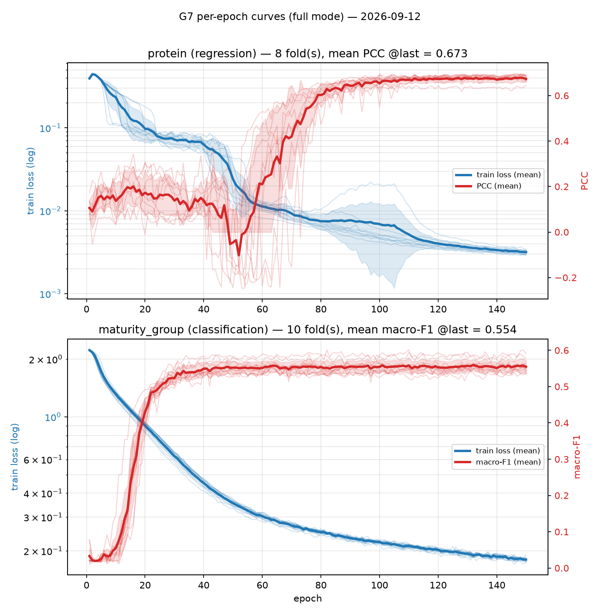

# SoyDNGPNext 复现项目

本仓库用于复现 SoyDNGP / SoyDNGPNext 的大豆基因组表型预测方法。工作内容包括公开数据整理、样本与表型对应、SNP 编码、模型训练、交叉验证以及结果留存。

项目以 [SoyDNGPNext 原始仓库](https://github.com/IndigoFloyd/SoyDNGPNext)为基础，保留原始实现，并在独立目录中补充数据处理、测试和复现实验代码。当前工作重点是确认公开代码能够处理公开数据，并如实记录与论文方法之间仍存在的差异。

## 项目进展

目前已经完成以下工作：

- 获取并校验 SoySNP50K Wm82.gnm2 数据；
- 按原项目使用的 SNP 顺序整理公开 VCF 数据；
- 对齐基因型样本与表型记录；
- 生成可供模型读取的基因型矩阵；
- 核对 CPU 与 GPU 两种读取方式的编码结果；
- 为回归和分类任务补充训练、评估与模型保存测试；
- 在蛋白质含量和成熟组两个性状上完成十折交叉验证。

公开原始数据包含 20,087 个样本和 41,726 个位点。原项目实际读取的 SNP 列表包含 32,032 个位点，其中 31,673 个可以按染色体和坐标在公开 VCF 中找到，其余 359 个按原项目规则记为缺失。完成样本匹配并去除无表型记录的样本后，训练数据包含 15,899 个样本。

模型输入为 `3 × 206 × 206` 的数组。每个基因型被转换到三个通道；当 SNP 数量不足以填满数组时，沿用原项目的循环填充方式。

## 当前结果

以下结果来自 15,899 个样本、十折交叉验证和每折 150 轮训练。每一折使用约九成样本训练，其余样本用于验证。主要结果取每折第 150 轮的验证指标，再计算十折的均值和标准差；训练期间出现的最佳验证指标作为补充信息列出。

| 性状 | 问题类型 | 评价指标 | 第 150 轮 | 训练期间最佳值 |
| --- | --- | --- | ---: | ---: |
| 蛋白质含量（Protein） | 回归 | Pearson 相关系数 | 0.6701 ± 0.0153 | 0.6821 ± 0.0156 |
| 成熟组（Maturity group） | 十分类 | Macro-F1 | 0.5544 ± 0.0173 | 0.5699 ± 0.0159 |

<details>
<summary>查看蛋白质含量逐折结果</summary>

| 折次 | 训练样本 | 验证样本 | 第 150 轮 PCC | 最佳 PCC |
| ---: | ---: | ---: | ---: | ---: |
| 1 | 14,309 | 1,590 | 0.6687 | 0.6799 |
| 2 | 14,309 | 1,590 | 0.6457 | 0.6633 |
| 3 | 14,309 | 1,590 | 0.6890 | 0.6957 |
| 4 | 14,309 | 1,590 | 0.6451 | 0.6453 |
| 5 | 14,309 | 1,590 | 0.6839 | 0.6924 |
| 6 | 14,309 | 1,590 | 0.6680 | 0.6844 |
| 7 | 14,309 | 1,590 | 0.6815 | 0.6947 |
| 8 | 14,309 | 1,590 | 0.6623 | 0.6929 |
| 9 | 14,309 | 1,590 | 0.6676 | 0.6781 |
| 10 | 14,310 | 1,589 | 0.6892 | 0.6939 |
| **均值 ± 标准差** | — | — | **0.6701 ± 0.0153** | **0.6821 ± 0.0156** |

</details>

<details>
<summary>查看成熟组逐折结果</summary>

| 折次 | 训练样本 | 验证样本 | 第 150 轮 Macro-F1 | 最佳 Macro-F1 |
| ---: | ---: | ---: | ---: | ---: |
| 1 | 14,309 | 1,590 | 0.5364 | 0.5543 |
| 2 | 14,309 | 1,590 | 0.5452 | 0.5723 |
| 3 | 14,309 | 1,590 | 0.5578 | 0.5704 |
| 4 | 14,309 | 1,590 | 0.5779 | 0.5946 |
| 5 | 14,309 | 1,590 | 0.5341 | 0.5502 |
| 6 | 14,309 | 1,590 | 0.5520 | 0.5680 |
| 7 | 14,309 | 1,590 | 0.5476 | 0.5590 |
| 8 | 14,309 | 1,590 | 0.5617 | 0.5710 |
| 9 | 14,309 | 1,590 | 0.5909 | 0.6017 |
| 10 | 14,310 | 1,589 | 0.5407 | 0.5574 |
| **均值 ± 标准差** | — | — | **0.5544 ± 0.0173** | **0.5699 ± 0.0159** |

</details>



这些结果用于确认数据处理和训练过程可以完整运行，不应直接视为论文结果的严格复现。当前实验使用的是发行包中由 `model.yaml` 定义的网络；论文早期模型另有两个坐标注意力模块，两者并不完全相同。此外，当前回归实验采用均方误差，原始训练器默认采用 Smooth L1 损失。有关模型来源、逐折结果和已知差异，可查阅 [`upstream/REPRODUCTION.md`](upstream/REPRODUCTION.md)。

## 数据来源与处理

基因型数据来自 SoyBase 发布的 [SoySNP50K Song & Hyten 2015 数据集](https://data.soybase.org/Glycine/max/diversity/Wm82.gnm2.div.Song_Hyten_2015/)。本仓库记录了下载地址、文件校验值、SNP 顺序和表型来源，相关文件位于 `upstream/data_manifest/`。

原始 VCF 和生成后的训练矩阵体积较大，不纳入 Git。默认目录如下：

```text
data/
├── raw/
│   └── soybase_snp50k_gnm2/
│       └── glyma.Wm82.gnm2.div.Song_Hyten_2015.vcf.gz
└── derived/
    └── d3_matrix/
        ├── d3_matrix.npy
        ├── d3_sample_order.txt
        └── d3_snp_order.txt
```

数据整理遵循以下顺序：

1. 下载原始 VCF，并使用清单中的 MD5 或 SHA-256 校验文件；
2. 从 VCF 提取样本名和位点信息；
3. 按染色体与坐标匹配原项目的 SNP 列表，同时保留原有顺序；
4. 对齐 VCF 样本名和表型表中的材料编号；
5. 提取所需样本与位点，生成 `15,899 × 32,032` 的整数矩阵；
6. 将整数矩阵转换为模型需要的三通道输入。

样本对齐时，有 1,441 对材料编号仅在数字部分的前导零上存在差异，例如 `FC1547` 与 `FC001547`。当前数据集接受了这部分对应关系。由于无法取得作者当时使用的最终训练样本表，因此不能保证重建后的样本集合与论文完全一致。

详细的数据来源、校验值和处理记录见 [`upstream/data_manifest/provenance.yaml`](upstream/data_manifest/provenance.yaml)。

## 运行环境

复现实验使用 Python 3.12，并依赖以下主要软件：

- PyTorch；
- NumPy、pandas 和 scikit-learn；
- PyYAML；
- cuDF 与 CuPy（GPU 读取）；
- ONNX Runtime（模型推理）；
- bcftools（VCF 筛选）。

完整训练建议使用支持 CUDA 的 NVIDIA 显卡。CPU 版本可用于检查 VCF、验证编码和运行小规模测试，但全量训练耗时较长。GPU 相关组件需要与本机 CUDA 版本一致，具体依赖声明见 [`upstream/pyproject.toml`](upstream/pyproject.toml)。

如果已经准备好兼容的 PyTorch、RAPIDS 和 ONNX Runtime 环境，可安装仓库内保存的原始发行包：

```bash
python -m pip install --no-deps upstream/dist/soydngpnext-0.1.2-py3-none-any.whl
```

复现实验直接使用 `upstream/` 中的源码，无须安装发行包：

```bash
cd upstream
export PYTHONPATH="$PWD:$PWD/src"
```

## 基本使用

### 检查 VCF 输入

仓库提供了一个小型 VCF，可用于检查文件结构、基因型编码和模型输入尺寸：

```bash
cd upstream
python scripts/check_data_contract.py ../data/10_test_examples.vcf
```

如需同时检查表型文件，可将 CSV 路径作为第二个参数传入：

```bash
python scripts/check_data_contract.py path/to/data.vcf path/to/traits.csv
```

表型 CSV 的第一列应为样本编号，其余列为待预测性状。样本编号必须能够与 VCF 表头中的样本名对应。

### 运行测试

```bash
cd upstream
pytest -q
```

部分测试需要 CUDA、cuDF 和 CuPy。只具备 CPU 环境时，可先运行不依赖 GPU 的测试文件。

### 运行复现实验

训练前应确认以下文件已经生成：

```text
data/derived/d3_matrix/d3_matrix.npy
data/derived/d3_matrix/d3_sample_order.txt
upstream/results/data_contract/d2/d2_accepted_cohort.tsv
upstream/data_manifest/phenotype_table.csv
```

先运行缩小规模的检查：

```bash
cd upstream
python scripts/g7_paper_baseline.py quick all
```

确认数据和显存使用正常后，再运行完整训练：

```bash
python scripts/g7_paper_baseline.py full all
```

第二个参数可设为 `regression` 或 `classification`，分别只训练蛋白质含量或成熟组。完整实验包含十折、每折 150 轮训练，请预留足够的运行时间和显存。结果写入 `upstream/results/trainer_validation/`。

## 目录结构

```text
.
├── data/                         # 本地原始数据和中间文件，不纳入 Git
├── upstream/
│   ├── soydngpnext/              # 原始 Python 包
│   ├── src/
│   │   ├── paper_model/          # 从作者公开代码整理的论文模型
│   │   └── soydngp_repro/        # 训练、指标和数据划分实现
│   ├── scripts/                  # 数据整理、检查、训练和绘图脚本
│   ├── tests/                    # 自动化测试
│   ├── configs/                  # 训练设置
│   ├── data_manifest/            # 数据来源、SNP 顺序和表型记录
│   ├── results/                  # 检查结果、实验指标和图表
│   └── REPRODUCTION.md           # 完整技术记录
└── README.md
```

## 已知限制

- 作者论文训练所用的最终 VCF 和样本筛选规则未公开，当前数据集由可获得的 SoySNP50K 数据重建；
- 1,441 对样本编号依据前导零规则进行匹配，这一决定可能与作者原始处理不同；
- 当前正式结果只覆盖蛋白质含量和成熟组，尚未训练表型表中的全部性状；
- 当前结果使用发行包网络，而不是论文早期模型，不能用于声称已复现论文中的数值；
- 原项目提供的部分预训练权重尚未全部转换为当前 ONNX Runtime 可直接读取的格式。

## 与原项目的关系

`upstream-legacy` 标签保存原始代码快照，默认分支包含复现所需的兼容性修改、数据处理脚本和实验结果。原始训练器保留不动，新增训练代码放在 `upstream/src/soydngp_repro/`，便于区分作者实现和本仓库的修改。

使用本仓库进行研究时，请同时注明 SoyDNGPNext 原项目和 SoyBase 数据来源。本仓库当前未附带独立许可证；代码与数据的使用范围应分别遵循原项目及数据提供方的许可条件。
